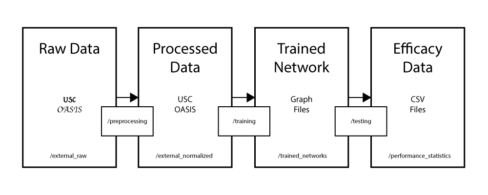
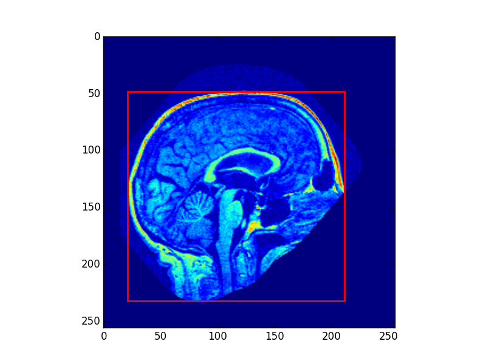
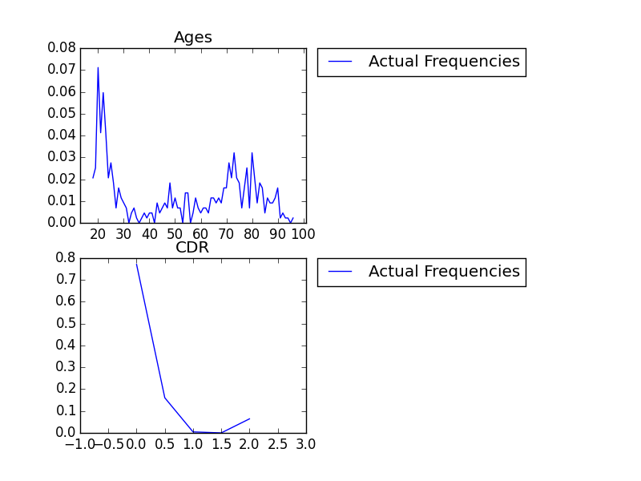

# research-alzheimers #

This repository contains a machine learning algorithm that will be used to predict whether or not patients have Alzheimer's disease.

### A brief note on copyright ###
Until this research is complete, we'd like a little bit of control over its distribution, so it is under proprietary license. Once the research is complete, we intend to release everything under MIT license. However, until then, this repository is COPYRIGHT JAKE BILLINGS AND GUNNAR ENSERO. ALL RIGHTS RESERVED.

## Team ##
- Jake Billings
- Gunnar Enserro
- Shaun Keys

## Contributing ##

Since we will be publishing the research, it is our responsibility to write clean, concise code that makes it easy for our peers to review our work. As a result, it is mandatory that we run a linter, such as the one built in to the PyCharm IDE. It is also necessary to document our code in English so that readers do not need to learn our syntax. In other words, we need to write good code. Code must also be well-documented and have decent user experience so that users can recreate our results.

We should create a guide for how to use our code to process data, train networks, and predict Alzheimer's disease.

All scripts should be somewhat standalone. We should probably use some sort of abstraction for user interaction, but I don't see a huge reason for scripts to depend on each other. Instead, each script should perform a certain task that is a step on the way to the binary classification of brain scans with or without Alzheimer's disease. Each script should be able to do its job on its own without worrying about other scripts. Note that it's fine for one to depend on the finished results of another.

For instance, it's fine for the training script to rely on data exported by the preprocessing script as long as we have a guide th at instructs users to run the pre-processing script first. We could even have multiple training scripts for multiple types of network. However, the code from one script should not rely on the code from another.

If scripts share code that should be abstracted, we should develop a pattern for shared code. It should be in a folder separate and distinct from runnable scripts that represent steps in the process.

## Architecture ##

### Processing ###
1. Collect gif images from OASIS database

2. Crop oasis gif images

4. Sort images by type (cor, sag, and tra)

5. Resize images to the mean size within their type

6. Sort into training/positive, training/negative, test/positive, and test/negative using random decisions and patient data.

7. Train the Keras neural network

## Source Database ##
http://www.oasis-brains.org/app/template/Index.vm
P50 AG05681, P01 AG03991, R01 AG021910, P20 MH071616, U24 RR021382
